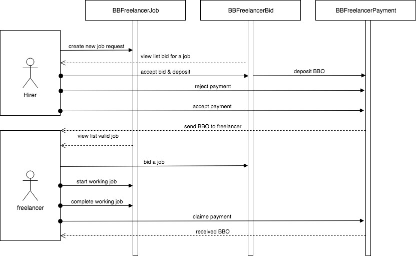
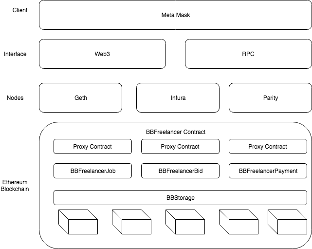

# Freelancer Smart Contract Architecture

### Introduction 

There are three main components in Bigbom Freelancer App: `BBFreelancerBid.sol`, `BBFreelancerJob.sol`, `BBFreelancerPayment.sol`

`BBFreelancerJob.sol`: manage job information

`BBFreelancerBid.sol`: manage biding

`BBFreelancerPayment.sol`: manage payment

### High-level Overview

BBOFreelancer Dapp allows the hirer to post the job, they will automatically begin to receive bids from the freelancers. They can choose the best freelancer & success work.

### Detailed Hirer Flow

* Post a job
* Choose the perfect freelancer 
* Pay & success

### Detailed Freelancer Flow

* Find a job
* Make your best bid 
* Get awarded and earn

### Stack

### Permissions

BBFreelancer always has proxy contract over each contract to make the contract upgradeability. They are has `Admin permision` is allowed to write to `BBStorage` contract 
