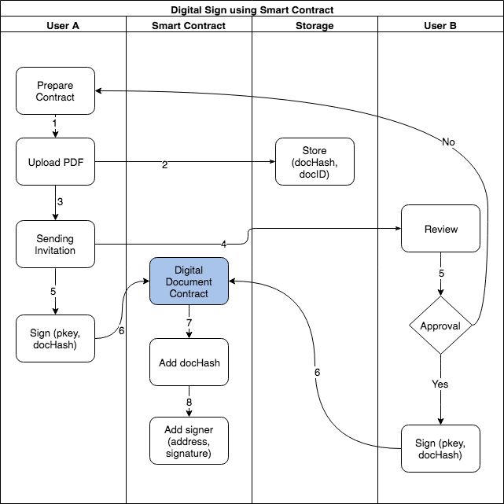

# Bigbom Digital Contracts, Why and How

## A brief history on contracts signing

**Paper Contract:** The oldest, most popular method for establishing business relationship. Usually it requires two people, representing their organization or themselves, in order to sign the contract. Some contracts requires a 3rd-party as the validator. 
Once signed, both parties is obliged to follow their duties, written in the contract. Whether a dispute happens, it will be resolve using the law of country that is designated in the contract.

One of the biggest problem with a paper contract is geography distance. Imagine Bob, which lives in New York and need to do business with a partner in South Africa, he has to travel approximately 15 hours in order to get to Johannesburg, took another day to meet the partner and sign to the contract, then take another same long flight back to New York. What happens if his partner suddenly changes his mind, refusing to sign into the contract? What happens if he's gone rouge, and ran off AFTER took your money? Is Bob gonna hire a lawyer to bring him to the court, and then paying all the expenses until he able to get the money back ?

With the development of internet communication, paper contract is less and less importance for a business, since it's show its weakness in cost and execution. That's why Digital Contract was invented

**Digital Contract aka Docusign and friends:** With the development of internet applications and cryptographic algorithm, e-signature solutions was developed to give users the capability of signing contract without having physical presence. One of the leading solution of e-signature is Docusign, which provides a Software-as-a-Service signing solution. Signing a contract now requires just a few steps:

1. Uploading a contract under digital format, eg PDF or word format
2. Send an invitation link to signers. Each signer requires to create an e-signature
3. Sign the document. The signed document then available for both parties, with the e-signature stamped on the document. 

With e-signature, Bob now does not need to spend 30 hours in airplane, and he still can do business with his partner in Johannesburg. But the problem still persist. There is no guarantee that his partner will follow his obligation in the contract. Geographic problem solved, but what about execution problem ?

## The introduction of Bigbom Digital Contract

Bigbom Digital Contract is a blockchain-based solution built with the aim of solving the contract signing and contract execution problem using a single platform. By combining the power of blockchain and e-signature, Bigbom Digital Contract will help people doing business together, with less worries about the authenticity of the contract, and the payment part of the contract. Let's take this scenario to see how Bigbom Digital Contract is going to work.

***Mandy is an advertiser, and she wants to run an ads campaign on John's website, https://thefamousjohn.com. Through direct contact, John is offering Mandy a Cost-Per-Click campaign, with the total 100,000 clicks on a banner sitting on top of John's website. The cost per every click is agree at 0.05$, which means it will cost Mandy $5000 for the whole campaign, expected to run in 15 days.***

Here is how Bigbom Digital Contract is going to take place.

**E-Signing:** John will draft a contract, with all the terms included. After that he will start uploading the contract, using PDF format into Bigbom Digital Contract platform. John then send an invitation to Mandy to her email address, asking Mandy to review and sign the contract. After John and Mandy signed the contract, Bigbom Digital Contract platform will calculate the hash of the document and store it into blockchain using a smart contract. By using this, signed data is permanent, and both John and Mandy can re-check the authenticity of the contract anytime.

Below is the workflow for signing a document by using smart contract


- docHash is a sha256 hash from uploaded pdf. Notes that the hash is not on the file, but on the contents itself. An example code in python  

```python
with open(‘/path/to/contract.pdf’, ‘rb’) as f:
    hash = hashlib.sha256(f.read()).hexdigest()

‘7642e521940f38349d3bdec2d129bd7ef9ce620ec525aca6ef892052aa52702a’
```
- abc

**Digital Contract Verification & Payment:** For contract execution, there are two key factors: Verifies that the contract has been executed as agreed, and proccessing the payment. Bigbom Digital Contract again utilizes the advantages of Smart Contract technology, to put these terms into the contracts as following

1. Contract start date
2. Contract end date
3. Contract type (currently we support CPC and CPI contract)
4. Contract value (could be either BBO or Fiat! We will explain how Fiat is going to be involed later)
5. Payment procedure(one time or partial payment)
6. Refund condition
7. Verification method(currently we support Google Analytics and Appsflyer)

Once these terms has been put into the smart contract. Bigbom Digital Contract platform will start to monitor the campaign, and consequentaly update the campaign into the smart contract, until it ends. At this point, both Mandy and John is aware about how well the campaign was, and what should be the actual cost.

**Payment:** Payment is a very complex topic. With a Digital Advertising Campaign, the actual bill is depends on various factor, like the actual amount of clicks or installations. Generally speaking, the contract will end up in these scenarios:

a. John get paid based on what he delivered, for example $3500 for 70,000 clicks after 15 days
b. John get paid full amount of $5000, if he able to deliver 100,000 clicks or more after 15 days
c. John does not get paid at all, since he's only able to deliver 9,000 clicks, and in the contract they both agreed that if the target dropped below 10%, Mandy won't have to pay anything.

Bigbom Digital Contract is able to adapt with all these scenarios. Before the contract goes into effective, it is required that Mandy needs to make a security deposit into the contract. The amount of security deposit is negotiable between Mandy and John. Bigbom Digital Contract will evaluate the amount of deposit and calculate the worth of clicks or installations that is equal to the amount of desposit. Since the campaign stats is constanly being monitored by Bigbom Digital Contract Platform, Mandy and John is able to see how much money has spent for the campaign. Before the deposit is being depleted, Bigbom Digital Contract Platform will notify Mandy for making another deposit, in order to keep the campaign running. If Mandy refuses to make the deposit, John will get a notification, suggesting him to suspend the campaign.

Even if Mandy keeps the commitment and send the security deposit, there is a possibility that John is not able to fulfill the contract terms, for example he cannot deliver more than 10,000 clicks after 15 days. In this case, since all the security deposit is being kept by the Digital Contract, John will receive any money, and at the end of the campaign, Mandy will get a refund, if the refund condition is met. 

A demonstration for this payment process is as following:

##############
Worlflow:
#############

**Fiat/Token conversion:** One of the biggest obstacle for people when using blockchain products is volatility in price. Imagine a token with a price $0.02 today become $0.05 tomorrow, and then drops back to $0.01 the day after. With the majority of people still using fiat currencies for daily trading, this volatility is unacceptable and prevent them to adopting blockchain products. With the aim to create an entrance for fiat users, Bigbom Digital Contract Platform is developing a method that calibrates the amount of actual BBO Token should be paid before the actual payment happens, so people will be kept away from the volatility in price. Here's how it works

Scenario 1: Mandy is a BBO hodler, and John acccept BBO for his payment. This is a very straight-forward case, Mandy will make the deposit by BBO, and John will get paid by BBO as well. 

Scenario 2: Mandy and John is not BBO holder, and they want to settle the contract in fiat, for example USD Dollar. Bigbom Digital Contract Platform will ask Mandy for making the deposit in fiat, by sending money via a payment gateway. After receiving the deposit, Bigbom Digital Contract Platform will calculate it to the actual BBO Token amount based on the market price, and took that amount of BBO from the Bigbom Reserve, then sending it to the Digital Contract as the deposit.

Once the contract finished, Bigbom Digital Contract Platform will re-calculate the actual amount of BBO needed to pay, based on John's performance and current market price. If there is insufficient of BBO for the payment, Bigbom Digital Contract Platform will took another BBO amount from the Bigbom Reserve, and make the payment to John. At the end of the day, John will receive the amount of BBO with similar value into USD Dollar that he supposed to get from Mandy. By integrating with other exchange platform, John will have the capability to swap BBO into Ethereum/Bitcoin, or even Fiat currencies after he received it. 

At current phase, we will support USD and SGD as accepted fiat currencies, and will integrate with Kyber Network for swapping BBO to ETH. More currencies and swapping method will come in the future.


